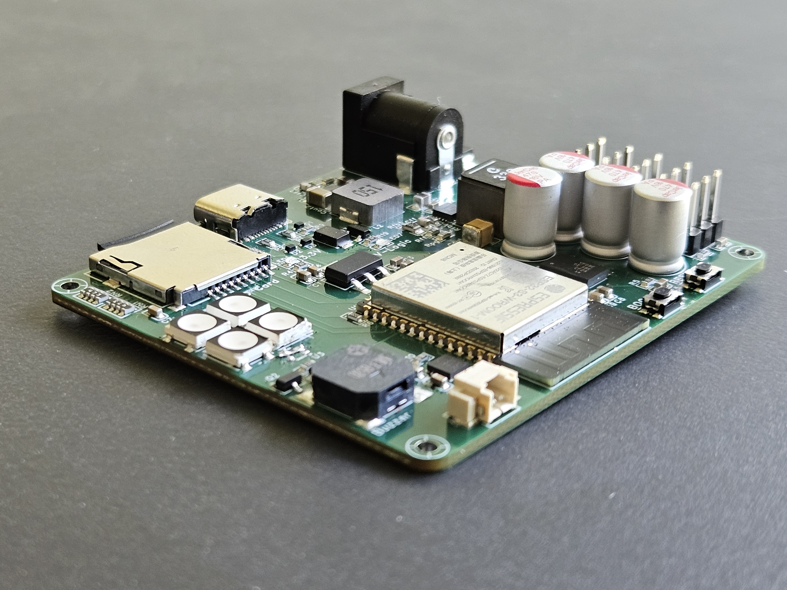
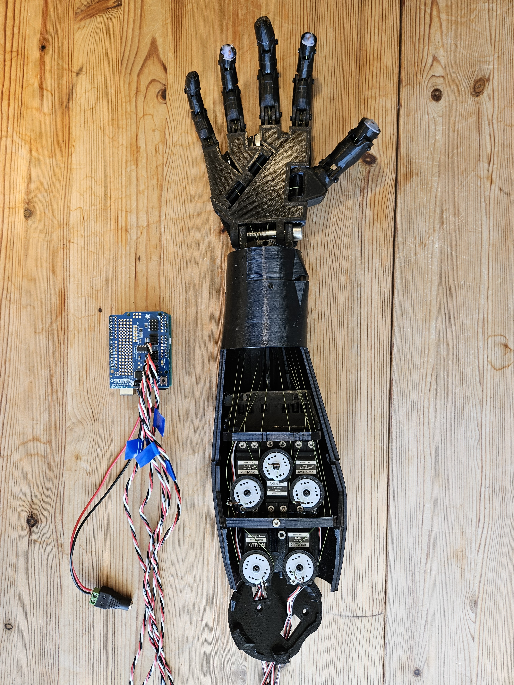
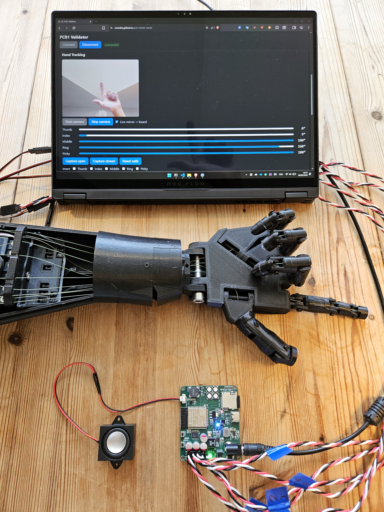
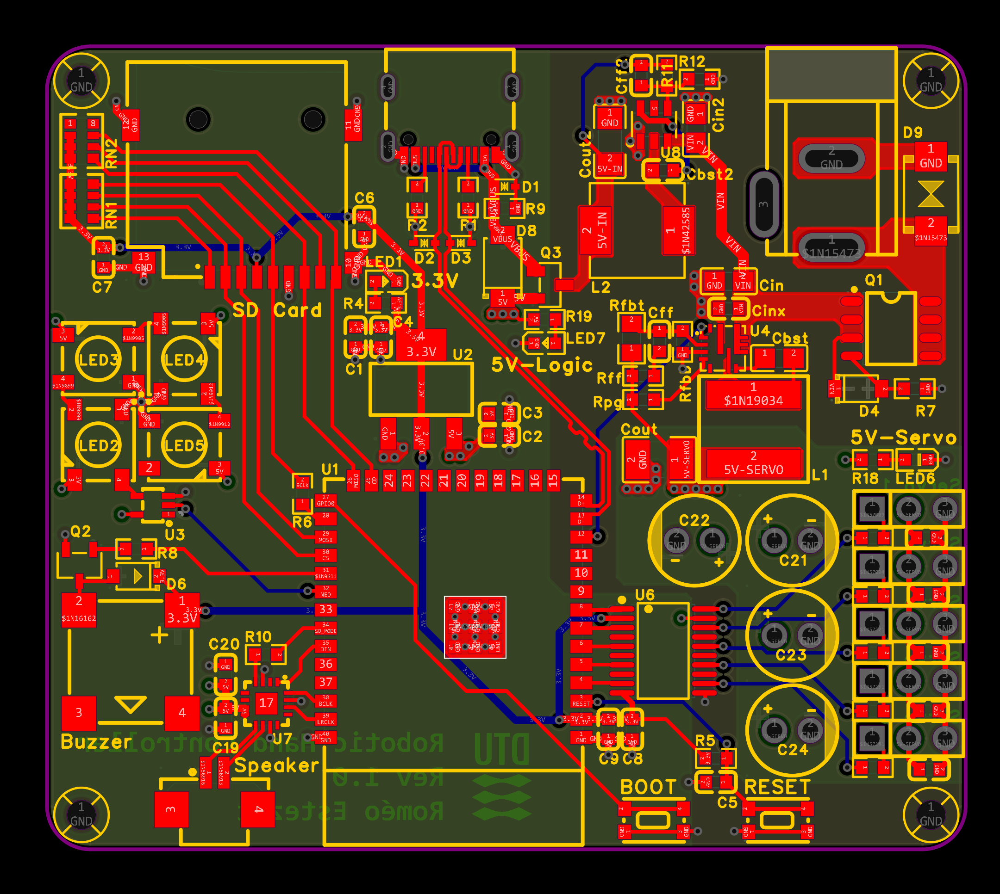
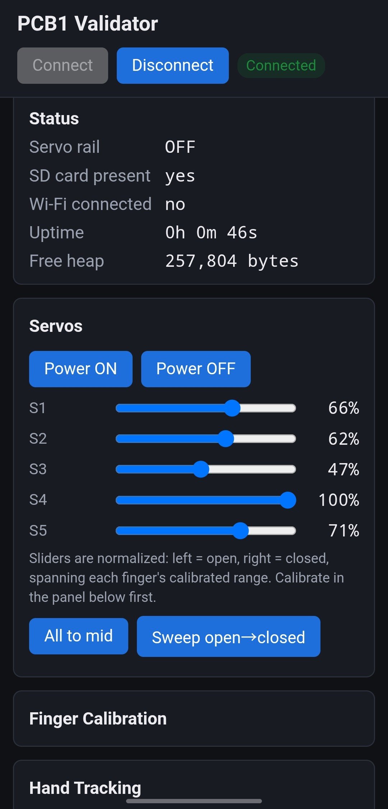

# Robotic Hand PCB — BSc Thesis (DTU)

[](https://github.com/Romultra/pcb-robotic-hand/actions/workflows/firmware.yml)
[](https://github.com/Romultra/pcb-robotic-hand/actions/workflows/ble-uuid-sync.yml)
[](https://github.com/Romultra/pcb-robotic-hand/actions/workflows/pages.yml)

<p align="center">
  
</p>

This is the first integrated PCB for a rehabilitation robotic hand that helps post-stroke patients
regain hand motor function through guided exercises. It was designed as a BSc thesis at the Technical
University of Denmark (DTU).

The board replaces the previous prototype's Arduino dev-board and servo shield with a single custom
PCB. It brings the microcontroller, motor drive, local storage, user feedback, and power management
onto one board. The design is complete, and the board was fabricated, assembled, and validated on the
bench. This is a first revision (PCB1), and it is wall-powered.

The full write-up is in [`Robotic-Hand-PCB-Thesis.pdf`](Robotic-Hand-PCB-Thesis.pdf).

## What the board does

| Subsystem | Key parts |
|-----------|-----------|
| MCU + wireless (Wi-Fi / BLE) | ESP32-S3-WROOM-1-N8 (native USB, no UART bridge) |
| Local storage | microSD card slot (SPI) |
| Motor driver (5× servo) | 5× 2.54 mm headers + TXS0108E level shifter, on a switchable 5 V rail |
| Audio nudge | MAX98357A I²S amp + speaker connector; MLT-8530 buzzer |
| Visual nudge | 4× WS2812B RGB LEDs + rail-status LEDs |
| Power | DC barrel jack + USB-C input; TPS56637 & TPS54202 bucks; AP2114H-3.3 LDO |

Full parts list: [`production/BOM_Board1_PCB1_2026-06-25.csv`](production/BOM_Board1_PCB1_2026-06-25.csv).
The original scope also included a battery subsystem for about a week of autonomy. This first
revision is wall-powered and the battery is left for a future revision.

One known fault reached PCB1: the WS2812B status LEDs have their power pins reversed in the
schematic, so they are non-functional on this board. It is a non-critical visual cue with a one-line
fix for the next revision. Details in
[`journal/decisions/001-ws2812b-power-pin-reversal.md`](journal/decisions/001-ws2812b-power-pin-reversal.md).

## The system it fits into

The robotic hand is an instructor the patient watches, not an orthosis worn on the hand. A camera
tracks the patient's own hand and the robotic hand mirrors it live, or it demonstrates a therapist-set
exercise while audio and visual cues guide the attempt. The board is validated with a small firmware
and a Web Bluetooth app that exercises every subsystem end to end.

<p align="center">
  
  
</p>

## Repository layout

- [`production/`](production/) — final manufacturing outputs: BOM, Gerbers, schematic PDF, netlist,
  pick-and-place, and volume pricing
- [`firmware/`](firmware/) — PlatformIO project for the ESP32-S3 validation firmware (Arduino core,
  NimBLE-Arduino; servos driven directly off LEDC). Exposes each subsystem over a BLE GATT service.
  See [`firmware/README.md`](firmware/README.md).
- [`webapp/`](webapp/) — vanilla HTML/CSS/JS validation app over Web Bluetooth (Chrome on Android),
  deployed to GitHub Pages. Pairs with the firmware to test each board feature. See
  [`webapp/README.md`](webapp/README.md).
- [`journal/`](journal/) — engineering notebook: chronological [`log.md`](journal/log.md), design
  [`decisions/`](journal/decisions/), subsystem [`topics/`](journal/topics/), and bench
  [`results/`](journal/results/)
- [`tools/`](tools/) — helper scripts (BLE UUID sync check, BOM appendix generator)
- [`docs/media/`](docs/media/) — board photos, schematics, PCB layout, scope captures, and app
  screenshots

## Documentation

- **Thesis report:** [`Robotic-Hand-PCB-Thesis.pdf`](Robotic-Hand-PCB-Thesis.pdf) is the full design
  and validation write-up.
- **Design rationale:** the [`journal/decisions/`](journal/decisions/) records explain why each
  choice was made, with alternatives considered.
- **Subsystem deep-dives:** [`journal/topics/`](journal/topics/) covers the power tree, MCU pinout,
  motor drive, storage, wireless, and the nudge system. Start with
  [`board-architecture.md`](journal/topics/board-architecture.md).

<p align="center">
  
  
</p>

## Getting started

Clone the repo:

```bash
git clone https://github.com/Romultra/pcb-robotic-hand.git
```

- **Firmware:** open [`firmware/`](firmware/) in PlatformIO, build, and flash over USB-C. Flash and
  monitor commands are in [`firmware/README.md`](firmware/README.md).
- **Web app:** the deployed validation app runs at
  [romultra.github.io/pcb-robotic-hand](https://romultra.github.io/pcb-robotic-hand/). Open it in
  Chrome on Android and tap **Connect**. To run it locally, see [`webapp/README.md`](webapp/README.md).

## License

This repository documents a BSc thesis project. See the thesis PDF for full context and attribution.
